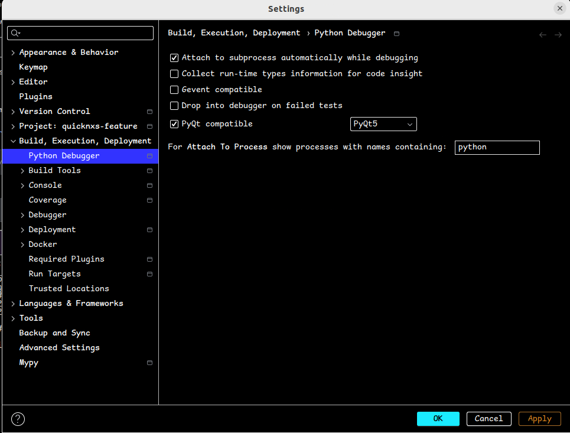

.. _development_environment:

Development Environment
=======================

.. contents::
    :local:

Setup Local Development Environment
-----------------------------------

To setup a local development environment, the developers should follow the steps below:

* Install `pixi <https://pixi.sh/latest/installation/>`_
* Clone the repository and make a feature branch based off ``next``.
* Create a new virtual environment with ``pixi install``
* Activate the virtual environment with ``pixi shell``
* Activate the pre-commit hooks with ``pre-commit install``

The ``pyproject.toml`` contains all of the dependencies for both the developer and the build servers.
Update file ``pyproject.toml`` if dependencies are added to the package.

.. _developing_with_pycharm:

Developing with PyCharm
-----------------------
Currently, QuickNXS contains PyQt5 and PiSide6 which are not compatible with each other
and therefore one must be selected as the default bindings to Qt.
Open the PyCharm settings and select `PyQt5` as the default bindings to Qt in the `python debugger`.

.. _test-data:

Test Data
---------

The test data will be stored in a second git repository
`quicknxs-data <https://code.ornl.gov/sns-hfir-scse/infrastructure/test-dataquicknxs-data>`_
which uses git-lfs.
To use it, first install git-lfs, then setup the git-submodule

.. code-block:: sh

   git submodule init
   git submodule update

See also :doc:`how to write integration tests <integration_test>`
