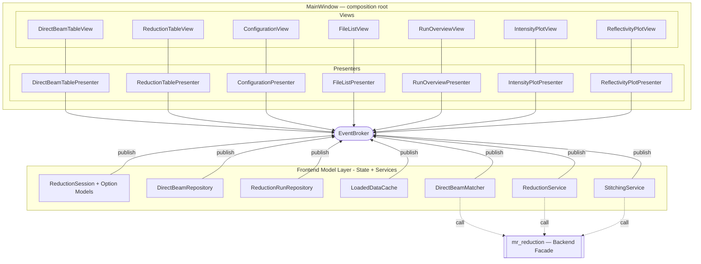
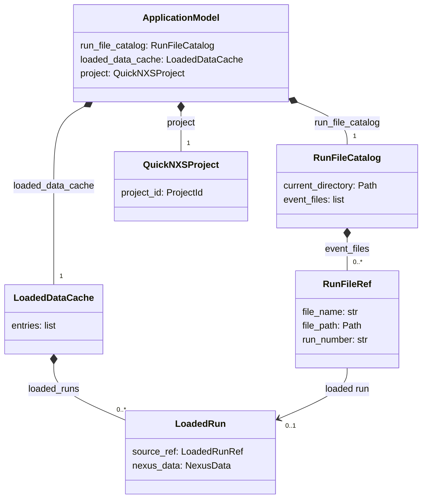
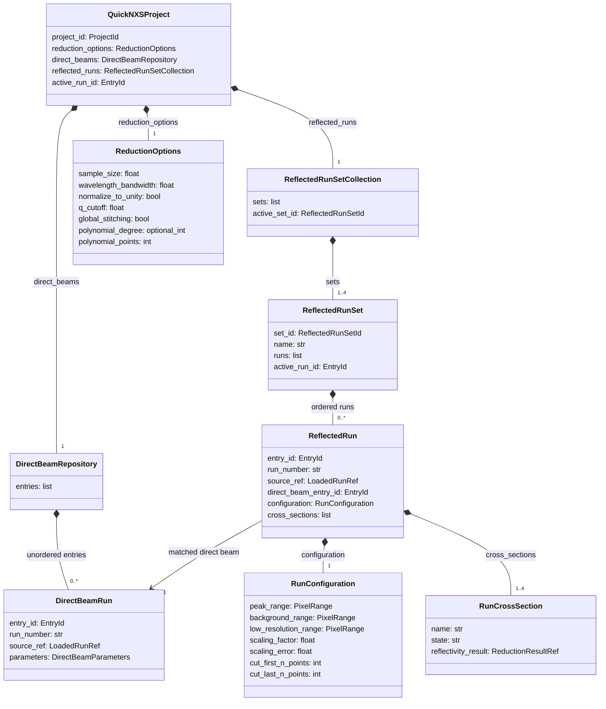

# QuickNXS Architecture Research: MVP, Technical Debt, and Backend Boundaries

Date consolidated: 2026-05-01

This document consolidates the prior MVP architecture and technical-debt research
notes into the active top-level architecture research document.

The consolidated document keeps the `research_mvp_architecture.md` filename because
several other planning documents already refer to it. The scope is now broader
than MVP alone: it covers the passive-view/MVP refactor, the main architectural debt
patterns, backend boundaries, and the recommended migration sequence.

## Executive Summary

QuickNXS works, and several useful boundaries already exist, but the application has
grown around implicit coordination. The main architectural issue is not one isolated
class. It is the combination of Qt widgets, mutable runtime objects, Mantid global
state, table/form binding, persistence, and reduction orchestration being coupled
through shared objects and signal cascades.

The most important recurring problems are:

- `MainWindow` and `MainHandler` together act as both UI and application coordinator.
- `auto_change_active` is a shared reentrancy guard that makes update chains fragile.
- `Configuration` represents too many concepts at once: global settings,
  run-specific parameters, UI state, and persistence fields.
- `DataManager` combines loaded data cache, session state, direct-beam matching,
  reduction list management, and reduction orchestration.
- Persistence is tied to live runtime objects and reflection-like copying instead of
  explicit versioned file models.
- QuickNXS has a partial backend split through `mr_reduction`, but no clear backend
  facade owns stable reduction, export, and persistence contracts.
- Tests capture useful workflows, but many tests preserve the existing coupling
  because they need real Qt widgets or large application objects.

The recommended direction is incremental:

1. Make session identity explicit, then add frontend view models and configuration
   inventory while leaving behavior unchanged.
2. Replace implicit signal cascades with explicit mutation and render phases.
3. Extract presenters/application commands from `MainHandler`.
4. Split `DataManager` into smaller session, loaded-data, direct-beam, reduction,
   and project-loading services.
5. Build backend APIs in `mr_reduction` for reduced-file I/O, matching,
   calculations, stitching, and output without requiring QuickNXS call-site changes.
6. Split `Configuration` into explicit global options, per-run parameters,
   view preferences, export options, and versioned persistence models.
7. Adopt backend APIs in QuickNXS through adapters after the relevant frontend and
   backend contracts exist.

The reduced-data-file I/O migration fits this roadmap as an early backend-boundary
slice. Backend parser/writer work can proceed before the full MVP refactor as long as
it introduces explicit file models and a narrow backend API rather than moving
QuickNXS widget assumptions into `mr_reduction`. QuickNXS save/load adoption is a
later frontend integration step.

## Repository Shape

The relevant packages are:

- `src/quicknxs/interfaces`: Qt user interface, handlers, plotting widgets, table
  binding, file loading entry points, and project save/load behavior.
- `src/quicknxs/data_handling`: QuickNXS reduction/session data structures and
  workflow helpers.
- `src/quicknxs/configuration`: mutable configuration object and defaults.
- `src/mr_reduction`: backend package intended to hold reusable reduction/export
  behavior.
- `tests`: a mixture of unit tests, workflow characterization tests, and Qt-coupled
  UI tests.

## What Is Already Structurally Useful

The current architecture has some good boundaries worth preserving:

- Data objects such as `NexusData` and `CrossSectionData` are mostly independent of
  Qt widgets.
- `DataManager` is at least recognizable as a model/session coordinator, even though
  it currently does too much.
- `PlotManager` is a reusable plotting component and is not simply embedded directly
  in every handler method.
- `ConfigurationHandler` and `PlotHandler` already indicate the direction of
  extracting concerns from `MainHandler`.
- Tests exist for important workflows, which gives future refactors a characterization
  base.
- `mr_reduction` exists, so backend migration can happen through an existing package
  rather than by inventing a new backend namespace.

The refactor should build on these boundaries instead of replacing the whole
application shape in one pass.

## Current Component Responsibilities

### `MainWindow`

`MainWindow` is the concrete Qt view. It owns widgets, layouts, menus, tables,
plotting areas, and signal declarations. It also exposes many widget instances
directly to handlers.

Current responsibilities include:

- Constructing the UI.
- Hosting direct-beam and reduction tables.
- Hosting plot widgets and controls.
- Emitting Qt signals for file, table, and configuration actions.
- Providing direct access to widgets that handlers read and mutate.

The target state is a passive view. `MainWindow` should continue to own widgets, but
business logic should interact with it through typed getters, display methods, and
user-action signals rather than direct widget access.

### `MainHandler`

`MainHandler` is the main application coordinator. It connects many Qt signals,
mutates `DataManager`, reads and writes widgets, updates tables, triggers plots,
handles file loading, and starts or refreshes reduction workflows.

This creates high coupling because a handler method can simultaneously:

- Read the active row or selected table cell.
- Mutate `NexusData` or `Configuration`.
- Update multiple widgets.
- Trigger plot recalculation.
- Emit additional Qt signals.
- Guard against recursive updates with `auto_change_active`.

The target state is a set of smaller presenters or application commands:

- `FilePresenter` for file navigation, file loading, active run/cross-section
  switching, run overview, DAS log display, and panel visibility.
- `ReductionPresenter` for direct-beam table actions, data table actions,
  reduction-list changes, direct-beam matching, stitching, trimming, and reloads.
- `PlotPresenter` for plot option changes and "should recompute" decisions.
- Optional later presenters for configuration, export, and job/progress handling.

### `ConfigurationHandler`

`ConfigurationHandler` owns much of the bridge between UI controls and
`Configuration`. The current code has mirrored logic for reading widgets into
configuration and populating widgets from configuration.

The target state is:

- A plain `ConfigViewModel` dataclass with no Qt dependency.
- `MainWindow.get_config_view_model()` reads widgets.
- `MainWindow.set_config_view_model(vm)` writes widgets.
- A presenter maps between `ConfigViewModel` and domain configuration objects.

This keeps widget names inside the view and domain field names inside presenter or
model code.

### `PlotHandler`

`PlotHandler` coordinates plot controls and plot refreshes. It is a useful extraction,
but some plot trigger decisions are still distributed across handlers and signal
cascades.

The target state is for plot recomputation decisions to be centralized in a
`PlotPresenter` or application command layer, while `PlotManager` remains focused on
rendering.

### `PlotManager`

`PlotManager` renders plots and manages plotting state. It should stay closer to a
renderer than an application coordinator.

The target state is for `PlotManager` to receive explicit plot view models or
snapshots, instead of reading broad mutable application state.

### `DataManager`

`DataManager` currently combines multiple responsibilities:

- Cache of loaded `NexusData` objects.
- Active item and cross-section state.
- Direct-beam list.
- Reduction/data-run list.
- Direct-beam matching.
- Reduction orchestration.
- Project/session save and load participation.
- Reload and refresh behavior.

The target state is to split these into a Qt-free frontend model layer while
keeping a temporary facade for compatibility. In this roadmap, "model layer"
means both runtime state models and the services that mutate or query them:

- `ReductionSession`: active run, active cross-section, selected table rows,
  direct-beam entries, reduction/data entries, run options, pairings, and result
  state.
- `DirectBeamEntry` / `ReductionRunEntry`: role-specific session rows keyed by
  stable entry IDs.
- Option models such as `ReductionOptions`, `LoadingOptions`,
  `RunReductionParameters`, `DirectBeamParameters`, `PlotViewPreferences`, and
  `ExportOptions`.
- `LoadedDataCache`: loaded files and run lookup.
- `DirectBeamRepository` / `ReductionRunRepository`: entry collection mutation and
  lookup.
- `DirectBeamMatcher`: a narrow matching service or backend adapter, not the owner
  of the direct-beam list.
- `ReductionService`: reduction orchestration and backend/current-code delegation,
  not UI rendering and not long-lived session ownership.
- `StitchingService`: stitching/scaling orchestration and backend/current-code
  delegation. Scale-factor state remains on reduction entries.
- `ProjectLoader` / `ProjectWriter`: frontend application of persistence models;
  canonical file parsing and writing belongs to the backend.

### `data_handling` and `ProcessingWorkflow`

The `data_handling` layer is mostly model-like, but parts of it still know too much
about application workflow and export behavior. `ProcessingWorkflow` is especially
important because it is close to backend logic but is not cleanly separated from
QuickNXS session concerns.

The target state is for backend-capable logic to depend on explicit DTOs and service
interfaces, not UI handlers or live `MainWindow` state.

### `mr_reduction`

`mr_reduction` is the natural backend package, but the split is incomplete. Some
canonical behavior still lives in QuickNXS, including reduced-data-file I/O.

The target state is a backend facade that QuickNXS can call and that `mr_reduction`
can also expose for scripting or non-Qt use.

## Architecture Findings

### Finding 1: The UI Layer Is Also The Application Coordinator

`MainWindow` and handlers are currently too entangled. Business logic reads and
writes concrete widget fields, and UI signals are used as the application event bus.

Architectural impact:

- Logic is hard to test without Qt.
- Widget names leak into business rules.
- Refactors risk breaking hidden signal ordering.
- A single user action can spread across several handlers through emitted signals.

Recommendation:

- Introduce an `IMainView` protocol or equivalent view interface.
- Keep `MainWindow` as the concrete Qt implementation.
- Move user-action handling into presenters/application commands.
- Let presenters call explicit view display methods.

### Finding 2: Event Flow Depends On Shared Reentrancy Flags

`auto_change_active` suppresses recursive table and widget updates. This is a sign
that render operations and user actions are not cleanly separated.

Architectural impact:

- The flag is global enough to suppress unrelated work.
- A missing reset can leave UI updates disabled.
- A handler must know whether it is running because of a user action or a programmatic
  render.
- It becomes difficult to reason about multiple table entries for the same run number
  when each table row may represent a different role or copied `NexusData` instance.

Recommendation:

- Use `blockSignals()` inside view display methods for programmatic rendering.
- Treat presenter methods as user-action entry points.
- Split each operation into mutation and render phases:
  - Mutate model/session state.
  - Build view models.
  - Render through view methods.

### Finding 3: `Configuration` Has Multiple Meanings

`Configuration` currently mixes global reduction settings, per-run parameters,
export options, UI preferences, and persistence details.

Architectural impact:

- It is difficult to tell which fields are global and which are run-specific.
- Save/load logic can accidentally persist UI-only state or omit domain state.
- Changes to a form control can affect reduction behavior through implicit shared
  references.
- Backend code is harder to isolate because it receives an application object instead
  of a focused options object.

Recommendation:

- Split configuration concepts into explicit models:
  - `ReductionOptions`
  - `RunReductionParameters`
  - `DirectBeamParameters`
  - `ViewPreferences`
  - `ExportOptions`
  - `ReducedDataFileModel`
- Add adapters from the current `Configuration` object during migration.

### Finding 4: `DataManager` Is A God Object For Session And Reduction

`DataManager` centralizes too many responsibilities. This makes it convenient but
hard to evolve.

Architectural impact:

- Data loading, direct-beam selection, active state, and reduction execution are
  coupled.
- It is difficult to test one responsibility without constructing many others.
- The object can become the implicit owner of every state transition.
- Multiple `NexusData` instances for the same run number require clearer identity
  rules than a broad manager can enforce informally.

Recommendation:

- Split `DataManager` behind a compatibility facade.
- Introduce explicit entry identifiers for table entries and session rows.
- Use run number for scientific/run identity, but object identity or explicit entry
  IDs for mutable session entries.

### Finding 5: Data Handling Still Depends On UI/Application Concerns

Some data handling and export paths still assume QuickNXS application state.

Architectural impact:

- Logic cannot be reused cleanly by `mr_reduction`.
- Backend tests risk depending on UI fixtures.
- Persistence and export formats can diverge between QuickNXS and backend code.

Recommendation:

- Move reusable reduction/export/persistence logic behind backend service contracts.
- Keep QuickNXS-specific adapters at the boundary.
- Use explicit DTOs for all backend calls.

### Finding 6: Reduction Code Is Coupled To Mantid Global Workspace State

Mantid Analysis Data Service state is global. QuickNXS code often relies on workspace
names and global registration rather than explicit handles.

Architectural impact:

- Tests can leak state between cases.
- Parallel or background work is risky.
- Object lifetime is harder to reason about.
- Errors may appear far from the operation that caused them.

Recommendation:

- Introduce a `WorkspaceHandle` abstraction where practical.
- Keep Mantid ADS interactions localized in a workspace service or factory.
- Ensure tests can isolate, create, and clean up workspaces deterministically.

### Finding 7: QuickNXS Has A Partial Backend Split With `mr_reduction`

`mr_reduction` exists, but QuickNXS still owns significant backend-like behavior.
Reduced-data-file I/O is a concrete example: QuickNXS has canonical behavior, while
backend logic duplicated and diverged.

Architectural impact:

- The backend cannot reliably load files written by QuickNXS or vice versa.
- Format ownership is unclear.
- Scripts and UI workflows may drift.

Recommendation:

- Make file I/O a backend concern.
- Define a versioned reduced-data-file model in `mr_reduction`.
- Have QuickNXS call backend read/write APIs through an adapter.
- Keep UI-only reconstruction in QuickNXS, but keep file format parsing and writing
  in the backend.

### Finding 8: Table And Form Binding Is Manual And Duplicated

Table and form update logic repeats field mappings in multiple directions.

Architectural impact:

- Adding a parameter requires editing several mirror paths.
- It is easy for load, save, table display, and UI form state to diverge.
- Handlers need widget-name knowledge.

Recommendation:

- Use view models for table rows and forms.
- Centralize mapping between domain objects and view models.
- Let the view only render and collect view models.

### Finding 9: Long-Running Work Runs Through The UI Event Loop

Some reduction and loading work is driven directly from UI handlers.

Architectural impact:

- The UI can become unresponsive.
- Cancellation and progress handling are not consistently modeled.
- Error reporting is mixed with UI state mutation.

Recommendation:

- Introduce a job/progress abstraction.
- Keep progress reporting behind a `ProgressSink` interface.
- Return typed results or errors from backend services.

### Finding 10: Error Handling Often Hides Domain Failures

Some errors are caught, logged, displayed generically, or converted into partial UI
state without a clear domain result.

Architectural impact:

- Users may see symptoms instead of actionable failures.
- Tests cannot assert specific failure modes.
- Backend logic cannot communicate rich errors to UI or script callers.

Recommendation:

- Define domain error categories for file parsing, invalid configuration, missing
  workspace, missing direct beam, reduction failure, and export failure.
- Let presenters translate domain errors into UI messages.
- Keep backend errors UI-independent.

### Finding 11: Persistence Is Reflection-Based And Tied To Runtime Objects

Reduced data files currently reflect live runtime objects and table state rather than
using a stable persistence schema.

Architectural impact:

- Format changes are hard to reason about.
- Loading older files requires reconstructing assumptions from runtime code.
- QuickNXS and `mr_reduction` can diverge.

Recommendation:

- Define explicit versioned persistence models.
- Add golden-file tests for supported versions.
- Keep migration logic at the file model boundary.
- Convert file models into runtime session objects after parsing.

### Finding 12: Tests Characterize Workflows But Also Preserve Coupling

Existing tests are valuable, but many tests instantiate broad application objects.

Architectural impact:

- Refactors require updating many tests at once.
- Tests can lock in incidental widget behavior.
- Backend logic cannot be tested independently.

Recommendation:

- Keep characterization tests around high-value workflows.
- Add narrower unit tests for presenters, view-model builders, backend file models,
  direct-beam matching, and configuration mapping.
- Use fake views and fake backend services where possible.

## Signal And Update Chains

### Direct-Beam Peak Change

The direct-beam peak edit is the most useful example because it touches table
binding, model mutation, plot refresh, and direct-beam/data-run relationships.

Current shape:

1. A table cell changes.
2. The handler checks `auto_change_active`.
3. The handler reads row/column state from the widget.
4. A `NexusData` or parameter object is mutated.
5. Additional table rows and plots are updated.
6. Other signals may be emitted to refresh related views.

Target shape:

1. User edits a cell in `DirectBeamTableView`.
2. The view fires its `on_cell_edited` hook with `(entry_id, column, value)`.
3. `DirectBeamTablePresenter` calls `direct_beam_repository.update_entry(entry_id,
   ...)`.
4. `DirectBeamRepository` publishes `DirectBeamEntryUpdatedEvent(entry_id)` to the
   event broker.
5. `DirectBeamTablePresenter` (subscriber) receives the event and calls
   `self._view.render_rows(updated_rows)`.
6. `ReductionTablePresenter` (subscriber) receives the event and calls
   `self._view.render_rows(rows)` to refresh match indicators.
7. `ReflectivityPlotPresenter` (subscriber) receives the event and calls
   `self._view.render_plot(plot_vm)`.

The initiating presenter re-renders its own view through the same event path as
all other subscribers. No special direct render call is needed from the presenter
after the mutation.

This pattern is especially important now that the same run number can appear as
multiple `NexusData` instances in different roles. The presenter should not assume
that run number uniquely identifies a mutable table entry.

### File Loaded Chain

Current file loading updates active data, file lists, metadata panels, plots, and
possibly table eligibility. The ordering is implicit because handler methods emit
signals that trigger other updates.

Target shape:

- File loading returns a loaded-data object or a structured failure.
- The session receives or reuses an entry for the loaded run.
- The presenter explicitly renders file list, active run details, DAS logs, and plots.
- Eligibility decisions for direct-beam/data-run tables are made by model services,
  not by widget state.

### Reduction Table Edit Chain

Current reduction table edits are similar to direct-beam edits but affect data-run
parameters and reduction outputs.

Target shape:

- A table row should map to a stable session entry ID.
- Run number can be displayed and used for scientific matching, but should not be the
  primary key for the row.
- Updating one row should not accidentally update another row with the same run
  number unless the operation intentionally targets all entries for that run.

### Global Configuration Change Chain

Global configuration changes currently propagate through UI reads, configuration
mutation, and plot/reduction refreshes.

Target shape:

- The view emits a typed configuration action or submits a `ConfigViewModel`.
- The presenter maps the view model to project-owned `ReductionOptions`.
- The model identifies affected entries.
- The presenter renders the resulting table and plot view models.

## Identity Rules For Run Numbers And `NexusData` Instances

The new direct-beam/data-run flexibility makes identity rules explicit and important.
The same run number can appear in more than one session role, and deep-copied
`NexusData` objects can carry different role-specific parameters.

The detailed identity source of truth is
[session_identity_contract.md](session_identity_contract.md).

Use run number when the question is about the scientific source run:

- Matching a data run to a compatible direct beam by run metadata.
- Displaying run labels in tables, file lists, and exported files.
- Grouping warnings or diagnostics for the same source file.
- Detecting whether a file has already been loaded into the loaded-data cache.
- Looking up immutable metadata from the original Nexus file.

Use object identity, a session entry ID, or an explicit role-specific entry model when
the question is about mutable reduction state:

- Editing peak position, background, scaling, or normalization parameters.
- Updating one row in the direct-beam table or data table.
- Pairing a specific data-table entry with a specific direct-beam-table entry.
- Saving and loading a reduction session where the same run appears in both tables.
- Comparing whether two table rows are the same row.
- Deciding whether a render update should preserve selection.

Recommended model:

- Keep an immutable or mostly immutable loaded-run cache keyed by run number and file
  identity.
- Create role-specific session entries with stable IDs:
  - `DirectBeamEntry(entry_id, run_number, nexus_data, parameters, source_ref)`
  - `ReductionRunEntry(entry_id, run_number, nexus_data, direct_beam_entry_id,
    parameters, source_ref)`
- Avoid using `run_number` as the only key in direct-beam or reduction tables.
- Use explicit matching fields when the backend needs to serialize relationships:
  run number for human readability, entry ID or stable file/session reference for
  exact row relationships.

## Target Architecture



Each view is paired one-to-one with its presenter (solid lines within
`MainWindow`). Presenters subscribe to and receive notifications from the
`EventBroker` (undirected lines). Model/session services publish domain events to
the broker after state mutations. Services that need canonical scientific or
file-format behavior call the backend facade (dashed lines). Presenters do not
hold references to each other; views do not interact with the broker.

At the application-runtime level, separate filesystem browsing state, loaded-data
runtime cache, and reduction project state:



`RunFileCatalog` replaces the current `DataManager.current_directory` and
`DataManager.current_event_files` concerns. It is application runtime state, not
reduction-project state: it supports file-list rendering, file dialogs, and
directory refresh behavior. `LoadedDataCache` is also runtime state and should stay
separate from `QuickNXSProject`, which owns the reduction-domain state. A file
watcher can refresh `RunFileCatalog`, but the watcher itself is infrastructure, not
part of the model.

The project model mirrors the current `DataManager` direct-beam and reflected-run
lists while making the collection semantics explicit:



`DirectBeamRepository` is intentionally named as a repository because direct-beam
order is not scientifically meaningful and reflected runs can match any direct
beam in the repository. `ReflectedRunSet` is intentionally not called a repository:
it is an ordered list of reflected runs selected to cover a larger Q range and to
be stitched together. The first implementation can still keep a compatibility
service named `ReductionRunRepository`; the runtime state model should move toward
ordered `ReflectedRunSet` objects. `ReductionOptions` is owned by
`QuickNXSProject` because its fields, including stitching controls, describe
project-level reduction behavior rather than one specific reflected-run set.

### Passive View

Views are concrete Qt classes decomposed by responsibility. Each view is paired
one-to-one with a presenter. A view does two things:

- Exposes user-action hooks (callable attributes or Qt signal connection points)
  that its presenter registers handlers on at construction.
- Exposes render methods that its presenter calls to update the display.

No protocol or ABC is required. The presenter holds a reference to the concrete
view class. For testing, the concrete view can be replaced with a lightweight fake
that records render calls.

The decomposition by responsibility (not exhaustive):

| View class | Presenter class | Primary responsibility |
|---|---|---|
| `FileListView` | `FileListPresenter` | File list, active file highlight |
| `RunOverviewView` | `RunOverviewPresenter` | Detector image, cross-section selector, DAS log, calculated data |
| `IntensityPlotView` | `IntensityPlotPresenter` | XY / X-TOF / overview plots and controls |
| `ReflectivityPlotView` | `ReflectivityPlotPresenter` | Reflectivity and compare-plots |
| `ConfigurationView` | `ConfigurationPresenter` | Global reduction settings, normalization, dead-time |
| `ReductionTableView` | `ReductionTablePresenter` | Data-run table rows |
| `DirectBeamTableView` | `DirectBeamTablePresenter` | Direct-beam table rows |

`MainWindow` owns the Qt layout and instantiates all view and presenter objects,
wiring them together at startup.

Views should not:

- Decide reduction behavior.
- Match direct beams to data runs.
- Know backend persistence format details.
- Reach into `DataManager` directly.
- Subscribe to or publish events on the event broker.

### Presenter/Application Command Layer

Presenters handle user actions and coordinate state changes:

- Validate the action.
- Call frontend model/session services and backend adapters where appropriate.
- Decide which view models must be refreshed.
- Ask the view to render them.
- Translate domain errors into UI messages.

The presenter should not manipulate individual Qt widgets. It should know view-model
fields, not widget names.

### Frontend Model Layer

The frontend model layer is the Qt-free application state and domain operation
boundary. It contains both passive data models and model/session services.

State models belong here when they represent live QuickNXS runtime state:

- `ReductionSession`, active selection, active cross-section, and result state.
- `DirectBeamEntry` and `ReductionRunEntry`, keyed by stable entry IDs.
- Option models for project reduction settings, loading, run reduction, direct-beam
  parameters, plot preferences, export, offspec, and GISANS.
- View-independent result models or references needed to rebuild view models.

Model/session services belong here when they mutate, query, or coordinate that
state:

- `LoadedDataCache`, direct-beam and reduction repositories, and session entry
  mutation.
- `DirectBeamMatcher`, as a narrow service that returns explicit match results by
  entry ID. After backend matching exists, this service should become a thin
  adapter around backend matching DTOs rather than duplicating backend rules.
- `ReductionService`, as orchestration that builds requests from session entries
  and option models, delegates calculation to current QuickNXS code or backend
  APIs, stores or returns results, and publishes result events.
- `StitchingService`, as orchestration that builds stitching requests from ordered
  reduction entries and project-owned reduction options, delegates to current
  QuickNXS code or backend stitching APIs, and applies scale-factor/error updates
  through `ReductionRunRepository`.

The frontend model layer should not contain Qt widgets, render logic, user-facing
message wording, canonical reduced-file parsing/writing, or reusable scientific
algorithms once those algorithms have backend APIs. Direct Mantid ADS access
should be localized behind workspace services in migrated paths.

These models and services should be testable without Qt.

### Backend Facade

QuickNXS should depend on a backend facade that exposes stable operations:

- Load/parse reduced-data files.
- Write reduced-data files.
- Build reduction/export requests from DTOs.
- Run reduction or delegate to current QuickNXS internals during migration.
- Return results and typed errors.

QuickNXS can initially adapt its existing runtime classes to the facade at the
application boundary. The backend facade itself should remain independent of
QuickNXS runtime objects.

### Mutation And Render Phases

Each user action should follow a clear two-phase shape:

1. Mutation phase:
   - Apply the requested change to session/model/backend state.
   - Recalculate derived state.
   - Produce typed results or errors.
2. Render phase:
   - Build view models from the resulting state.
   - Render through view display methods.
   - Programmatic widget updates block signals locally.

This replaces broad reentrancy flags with local, explicit rendering behavior.

## Event Broker

The event broker coordinates state-change notifications across model services,
presenters, and (where needed) model services that observe other model changes. It
replaces both the `auto_change_active` reentrancy guard and direct cross-presenter
coupling.

### Design

The event broker is a plain Python object with no Qt dependency. It is
instantiated once in the composition root and passed to all presenters and model
services at construction.

```python
class EventBroker:
    def subscribe(self, event_type: type, handler: Callable) -> None: ...
    def publish(self, event: object) -> None: ...
```

Dispatch is synchronous. All registered handlers for an event type are called
before `publish` returns.

### Publishers

Model and session services publish events after state mutations. Presenters do not
publish events directly.

### Subscribers

Presenters subscribe to domain events and call their own view's render methods on
receipt. Model services may also subscribe (for example, a direct-beam matching
service that re-runs when a run is loaded). Views never subscribe to or publish
events on the broker.

### Example event taxonomy

```python
@dataclass(frozen=True)
class RunLoadedEvent:
    run_number: int
    entry_id: EntryId

@dataclass(frozen=True)
class ActiveRunChangedEvent:
    entry_id: EntryId

@dataclass(frozen=True)
class FileListChangedEvent:
    pass

@dataclass(frozen=True)
class DirectBeamEntryUpdatedEvent:
    entry_id: EntryId

@dataclass(frozen=True)
class DirectBeamListChangedEvent:
    pass

@dataclass(frozen=True)
class ReductionListChangedEvent:
    pass

@dataclass(frozen=True)
class GlobalOptionsChangedEvent:
    pass

@dataclass(frozen=True)
class RunOptionsUpdatedEvent:
    entry_id: EntryId

@dataclass(frozen=True)
class ReductionResultReadyEvent:
    entry_id: EntryId

@dataclass(frozen=True)
class StitchingCompletedEvent:
    entry_ids: tuple[EntryId, ...]

@dataclass(frozen=True)
class IntensityDataReadyEvent:
    entry_id: EntryId
```

### Reentrancy constraint

A subscriber must not cause the same event type to be published again during its
own handling of that event. This is a documented design constraint; enforce it
mechanically in a later phase if needed.

## MVP View And Presenter Design

### View–Presenter Wiring

Each view class is paired one-to-one with a presenter. The presenter:

- Holds a direct reference to its concrete view.
- Registers handler callables on the view's user-action hooks at construction
  time.
- Calls the view's render methods when a broker event subscription triggers a
  display update.

The view:

- Declares user-action hooks as callable attributes or Qt signal connection
  points.
- Declares render methods that accept typed view model payloads.
- Applies `blockSignals()` locally inside render methods to suppress re-entrancy.

No protocol or ABC is required. Presenter unit tests use a lightweight fake view
(a plain object with the same render method names, or `MagicMock(spec=ViewClass)`).

### Configuration View Model

Introduce a plain Python `ConfigViewModel`:

- No Qt dependency.
- Uses explicit field names and types.
- Represents the state of the configuration UI, not the entire domain
  configuration.

Migration steps:

1. Add `ConfigViewModel`.
2. Implement `MainWindow.get_config_view_model()`.
3. Implement `MainWindow.set_config_view_model(vm)`.
4. Move `get_configuration_from_ui()` mapping into a presenter or adapter.
5. Move `populate_from_configuration()` mapping into the same presenter or adapter.

### Table Row View Models

Introduce row models for direct-beam and reduction tables. Each row should include:

- Stable session entry ID.
- Display run number.
- Role-specific parameter values.
- Validation or warning state.
- Any linked direct-beam entry ID for data rows.

This directly addresses the multiple-`NexusData`-instances-per-run-number problem.

### Presenter Split

One presenter is paired with each view. Extraction follows coupling risk (highest
risk first):

1. `DirectBeamTablePresenter`: direct-beam table cell edits, add/remove/clear
   direct beams, active direct-beam row selection changes.
2. `ReductionTablePresenter`: reduction table cell edits, add/remove/clear data
   runs, active reduction row changes, stitching, overlap stripping,
   trim-to-normalization.
3. `RunOptionsPresenter`: per-run peak, background, and scaling parameter form.
4. `GlobalOptionsPresenter`: global reduction settings, normalization, dead-time
   toggle, and other configuration form fields.
5. `FileListPresenter`: file navigation, file loading, active file selection, and
   file list rendering.
6. `RunOverviewPresenter`: run overview rendering, cross-section selection, DAS
   log rendering, calculated data display, and panel visibility.
7. `IntensityPlotPresenter`: plot trigger decisions and rendering for XY, X-TOF,
   and overview intensity plots.
8. `ReflectivityPlotPresenter`: plot trigger decisions and rendering for
   reflectivity and compare-plots.

`MainHandler` acts as a compatibility bridge during migration and is retired once
all orchestration has moved into the focused presenters.

## Backend And Persistence Target

### Reduced-Data-File I/O

Reduced-data-file I/O should be a backend concern because the format is a contract
between tools, scripts, saved projects, and future versions. QuickNXS should not be
the only owner of canonical parsing and writing.

However, loading has two layers:

- Backend layer:
  - Parse bytes/files.
  - Validate schema version.
  - Migrate old versions.
  - Return a `ReducedDataFileModel`.
  - Write a `ReducedDataFileModel`.
- QuickNXS application layer:
  - Convert the file model into loaded files, session entries, selected rows,
    active view state, and widget view models.
  - Report UI-specific warnings and missing-file prompts.

So file parsing/writing belongs in the backend, while reconstructing the live
QuickNXS UI session remains an application concern.

### Versioned File Models

Use explicit persistence models:

- `ReducedDataFileModel`
- `ReducedDataRunModel`
- `ReducedDirectBeamModel`
- `ReducedGlobalOptionsModel`
- `ReducedReflectivityCurveModel`
- `ReducedFileMetadata`

The model should include:

- Schema version.
- Source run metadata.
- Role-specific entries.
- Direct-beam/data-run pairings.
- Global options.
- Run-specific parameters.
- Combined reflectivity curve table.
- Compatibility fields for older files where needed.

### Backend Facade Shape

A starting facade could expose:

```python
class ReductionBackend:
    def load_reduced_data_file(self, path: str) -> ReducedDataFileModel: ...
    def save_reduced_data_file(self, path: str, model: ReducedDataFileModel) -> None: ...
    def build_reduction_request(self, session_model: ReductionSessionModel) -> ReductionRequest: ...
    def reduce(self, request: ReductionRequest) -> ReductionResult: ...
```

During migration, `reduce()` may still delegate to current QuickNXS internals. The
important long-term step is that QuickNXS calls a stable backend boundary rather than
duplicating format or reduction rules. Backend phases should still avoid importing
QuickNXS runtime objects; temporary delegation, if ever needed, belongs in QuickNXS
adapter code rather than in `mr_reduction`.

## Split Migration Roadmap

The active migration is split into a frontend roadmap and a backend roadmap. Each
roadmap has its own consecutive phase numbering starting from 1. The detailed map of
active plan documents lives in [overview.md](overview.md).

### Frontend Phase 1: Stabilize Identity And View Contracts

Goals:

- Define session identity rules while preserving current behavior.
- Add characterization tests around duplicate run numbers and copied `NexusData`
  instances.
- Add read-only row view models and a configuration field inventory.
- Prepare for presenter extraction without switching live workflows.

Work:

- Phase 1A: identity contract adoption and characterization tests.
- Phase 1B: read-only direct-beam and reduction table row view models with stable
  entry IDs.
- Phase 1C: `ConfigViewModel`, configuration field inventory, and adapters.
- Phase 1D: narrow target `IMainView` interface and fake view tests.

### Frontend Phase 2: Replace Shared Reentrancy With Local Render Blocking

Goals:

- Remove reliance on `auto_change_active` for the most complex update paths.
- Make update ordering explicit.

Work:

- Add view display methods for direct-beam and reduction tables.
- Use `blockSignals()` inside display methods.
- Convert direct-beam peak edits to mutation/render phases.
- Convert reduction table edits to the same pattern.
- Add tests proving that editing one entry does not mutate a separate entry with the
  same run number unless explicitly intended.

### Frontend Phase 3: Extract Presenters And Application Commands

Goals:

- Reduce `MainHandler` responsibility.
- Introduce one presenter per view and the event broker.
- Make user-action logic testable without real Qt widgets.

Work:

- Introduce the event broker and define the initial event taxonomy.
- Decompose `MainWindow` into focused view classes, each paired with a presenter.
- Extract `DirectBeamTablePresenter` and `ReductionTablePresenter` first, because
  direct-beam/data-run logic has the highest coupling and highest risk.
- Extract `RunOptionsPresenter` and `GlobalOptionsPresenter` for configuration
  form fields.
- Extract `FileListPresenter` and `RunOverviewPresenter` for file and run
  navigation.
- Extract `IntensityPlotPresenter` and `ReflectivityPlotPresenter` for plot
  trigger decisions.
- Wire model services to publish domain events after state mutations.
- Keep `MainHandler` as a compatibility bridge until all orchestration has moved.

### Frontend Phase 4: Split `DataManager`

Goals:

- Separate loaded data, session entries, matching, and reduction orchestration.
- Make identity rules explicit.

Work:

- Introduce a loaded-run cache keyed by file/run identity.
- Introduce `ReductionSession` plus direct-beam and reduction-run entry models
  keyed by entry ID.
- Introduce direct-beam and reduction-run repositories for entry mutation and
  lookup.
- Move direct-beam matching into a narrow service/backend adapter that returns
  explicit match results by entry ID.
- Move reduction execution orchestration into a service that builds requests from
  session entries and option models.
- Move stitching/scaling orchestration into a service that updates reduction entry
  scale factors through the repository/session boundary.
- Keep a `DataManager` facade temporarily so existing callers can migrate gradually.
- Add focused tests for each service.

### Frontend Phase 5: Replace Global Configuration And Add Job/Error Boundaries

Goals:

- Finish separating UI, domain, persistence, and backend state.
- Improve long-running work, error reporting, and testability.

Work:

- Split `Configuration` into explicit frontend model-layer option models.
- Add adapters from old `Configuration` during transition.
- Introduce backend/domain error result types.
- Add a progress/job abstraction for loading, reduction, export, and save/load.
- Localize Mantid ADS access behind workspace services.
- Consider lightweight model notifications after presenter boundaries are stable.

### Backend Phase 1: Backend API Contracts And Common Models

Goals:

- Define common backend request/result dataclasses.
- Keep shared backend contracts independent of QuickNXS runtime objects.
- Provide a common vocabulary for the functional backend phases.

### Backend Phase 2: Backend Facade And Reduced-Data-File I/O

Goals:

- Make `mr_reduction` the owner of reusable backend contracts.
- Add backend reduced-data-file parsing/writing APIs.
- Stop format drift between QuickNXS and backend code.
- Preserve direct-beam/data-run pairing by entry identity.

Work:

- Add backend reduced-file parser and writer APIs.
- Port QuickNXS reduced-file behavior into backend tests.
- Represent direct-beam entries as entries, with run number as source metadata.
- Treat `DB_ID` as a file-local direct-beam entry reference.
- Leave QuickNXS-specific session reconstruction and save/load call-site migration
  to future QuickNXS adapters.
- Move canonical reflectivity output behavior into backend APIs where it can serve
  both QuickNXS and non-UI callers.

### Backend Phases 3-10: Backend Scientific And Output Services

These phases move additional reusable responsibilities into `mr_reduction`:

- Backend Phase 3: direct beam matching.
- Backend Phase 4: specular reflectivity calculation.
- Backend Phase 5: stitching, scaling, merging, and normalize-to-unity behavior.
- Backend Phase 6: off-specular reflectivity calculation.
- Backend Phase 7: GISANS calculation.
- Backend Phase 8: run metadata, ROI, peak finding, and data type classification.
- Backend Phase 9: raw NeXus loading, cross-section splitting, and dead-time
  correction.
- Backend Phase 10: output and export artifacts.

## Highest-Value Refactor Targets

The best first targets are:

1. Session identity contract and duplicate-run-number characterization tests.
2. Direct-beam and reduction table row view models with stable entry IDs.
3. Backend reduced-data-file DTOs and golden-file tests.
4. Replacement of `auto_change_active` on direct-beam and reduction table updates.
5. `ReductionPresenter` extraction.
6. `DataManager` facade split around loaded data, session entries, direct-beam
   matching, and reduction execution.
7. Backend facade for reduced-data-file I/O.
8. Configuration split into explicit option models.

These targets are high value because they reduce the most fragile coupling while
supporting current feature work around direct-beam/data-run role flexibility and
backend I/O migration.

## Testing Strategy

Add tests in layers:

- Golden-file tests for reduced-data-file read/write compatibility.
- Unit tests for backend file models and migrations.
- Unit tests for table row view-model builders.
- Unit tests for direct-beam matching and duplicate-run-number behavior.
- Presenter tests with fake views and fake services.
- Characterization tests around current UI workflows before changing high-risk code.
- Future integration tests for QuickNXS save/load through backend APIs after the
  frontend adapter exists.

Specific duplicate-run-number cases to test:

- A direct beam run can be added to the data table without sharing mutable parameters
  with the direct-beam table entry.
- A data run can be added to the direct-beam table without sharing mutable parameters
  with the data table entry.
- Editing peak/background/scaling on one entry does not mutate another entry for the
  same run number.
- Save/load preserves role-specific entries and pairings.
- Direct-beam matching can still use run metadata without treating run number as a
  unique table-entry identity.

## Relationship To Reduced-Data-File I/O Migration

The I/O migration and architecture cleanup are related but can be sequenced
pragmatically.

Backend I/O implementation can start independently if it follows these constraints:

- Define backend DTOs instead of moving QuickNXS runtime objects into `mr_reduction`.
- Preserve role-specific entry identity in the file model.
- Keep QuickNXS UI reconstruction and save/load call-site changes out of the backend
  phase.
- Add compatibility tests before changing writers.
- Do not make backend APIs depend on Qt, `MainWindow`, or widget table rows.

The larger architecture plan affects the backend I/O migration in these ways:

- The backend plan should call for explicit file models, not direct serialization of
  `DataManager`, `Configuration`, or `NexusData`.
- The backend plan should include duplicate-run-number and role-specific-entry cases.
- The backend plan should treat backend load/write as stable contracts.
- The backend plan should leave room for later `DataManager` and `Configuration`
  splits.

Backend I/O implementation should not wait for the full MVP refactor. QuickNXS
adoption of that backend I/O should wait until the identity and configuration adapter
work is ready enough to preserve entry-specific behavior.

## Reference Map For Existing Companion Documents

Some planning documents refer to earlier sections in the original MVP research file.
Use this map when following those references:

- Old section 6, "Concrete Update Chain: Direct Beam Peak Change":
  see "Signal And Update Chains" and "Identity Rules For Run Numbers And
  `NexusData` Instances".
- Old section 7, "Other Update Chains":
  see "Signal And Update Chains".
- Old section 8.2, "Problem Areas":
  see "Architecture Findings".
- Old section 9.3, "View Interface":
  see "MVP View And Presenter Design" and "View Interface".
- Old section 9.4, "Presenter Design":
  see "MVP View And Presenter Design" and "Presenter Split".
- Old section 10, "Handling Cascading Update Chains":
  see "Target Architecture" and "Mutation And Render Phases".
- Old section 11, "Migration Strategy":
  see "Split Migration Roadmap".

## Bottom Line

The codebase does not need a rewrite. It needs explicit boundaries around state,
commands, rendering, backend contracts, and persistence. The MVP/passive-view work and
the broader technical-debt plan point in the same direction:

- Views render and emit user intent.
- Presenters coordinate application actions.
- Session/model services own mutable application state.
- Backend services own reusable reduction, export, and file-format behavior.
- Persistence uses versioned models instead of live runtime objects.

The immediate practical win is to make direct-beam/data-run table identity explicit,
because that supports current feature work and creates the pattern needed for the
larger migration.
