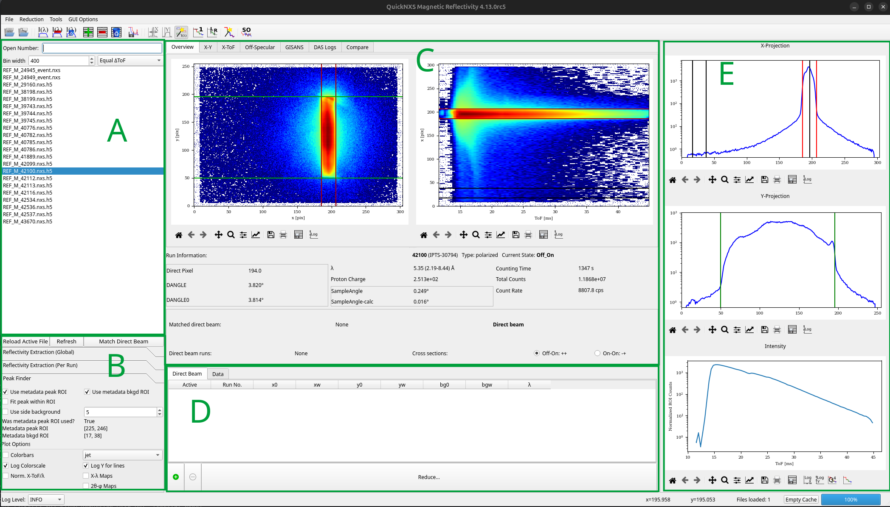

QuickNXS GUI Overview
=====================

QuickNXS bundles the full polarized reflectometry workflow into a single windowed
application so that scientists can load NeXus files, tune the region of interest
(ROI), and generate stitched reflectivity curves without juggling multiple scripts.
This page gives a high-level tour of the experience so new users know where to
start and what feedback to expect from the interface.

Primary Layout
--------------

The main window is split into several key areas, labeled in the figure below:

  * **A** - A text entry box to search for Nexus files by run number and a list of neighboring data files for quick loading.

  * **B** - Stacked panels that expose configuration and ROI controls.
    The ``Reflectivity Extraction (Global)`` and ``Reflectivity Extraction (Per Run)`` panels
    house the ``refXPos/refXWidth`` spin boxes, binning selectors, normalization switches, and dead-time settings.
    Automatic peak finder settings and plot customization options are also located here.

  * **C** - The main tab widget that holds the main overview tab which contains X-Y and X-ToF plots and various run information,
    as well as separate tabs for GISANS/off-spec tabs, the DAS log viewer, and more.

  * **D** - The reduction table with tabs for direct beam runs and reflectivity runs (labeled "Data"), and the "Reduce" button for initiating data processing.

  * **E** - Projection and intensity/reflectivity plots that visualize the current ROI selections and reduction results.

  * **Top toolbar** - provides quick access to common actions like opening files,
    adding runs to the data tables, and toggling certain functionality.
    Icons are grouped by function for ease of use. Hover over each icon to see its tooltip.

  * **Bottom toolbar** - log level selection and message area, progress bar for long-running
    operations, and a cache clear button to free up memory.

Core Workflow
-------------

1. **Load data** - use ``File > Open`` or the numbered run search to load one or
   more event files. QuickNXS auto-populates the file list, reduction table, and
   status bar once a selection is made.
2. **Match a direct beam** - assign direct beam runs through the dedicated tab
   or via the ``Match Direct Beam`` button. When a match exists, the UI can pull
   the direct beam ROI and ``dpix`` into the reflectivity runs automatically.
3. **Tune ROIs** - adjust ROI spin boxes, drag handles on the projection plots,
   or edit the reduction table columns. Every editor emits the same
   ``changeRegionValues`` signal, so the configuration stays synchronized no
   matter where the change originated.
4. **Process + inspect** - QuickNXS recalculates reflectivity (or GISANS/off-spec)
   whenever inputs demand it, updating the main plot as well as the specular
   viewer. Tooltips and the status bar report long-running steps such as Mantid
   reductions or GISANS rebins.
5. **Export or propagate** - right-click menus let users export run tables,
   propagate settings across tabs, or remove runs. The context menu keeps bulk
   actions close to the data they act upon.

Feedback + Safeguards
---------------------

* The **status bar** shows cache usage, log level, and progress bars for Mantid
  operations, preventing the UI from feeling frozen during heavy reductions.

* ``auto_change_active`` guards protect the tables from emitting recursive change
  signals while scripts update cells programmatically. This makes the UI feel
  responsive even when hundreds of rows are touched.

* Validation is immediate: invalid numeric edits revert to the previous value and
  pop up an explanatory message. Direct beam lookups state when a run number is
  unknown, reducing silent mistakes.

Additional Notes
----------------

* The direct pixel overwrite value (`dpix`) of a reflected run is linked to the peak position of its matched direct beam.
  Adjusting the peak position of a direct beam run will automatically update the `dpix` of all linked reflected runs to maintain consistency.
