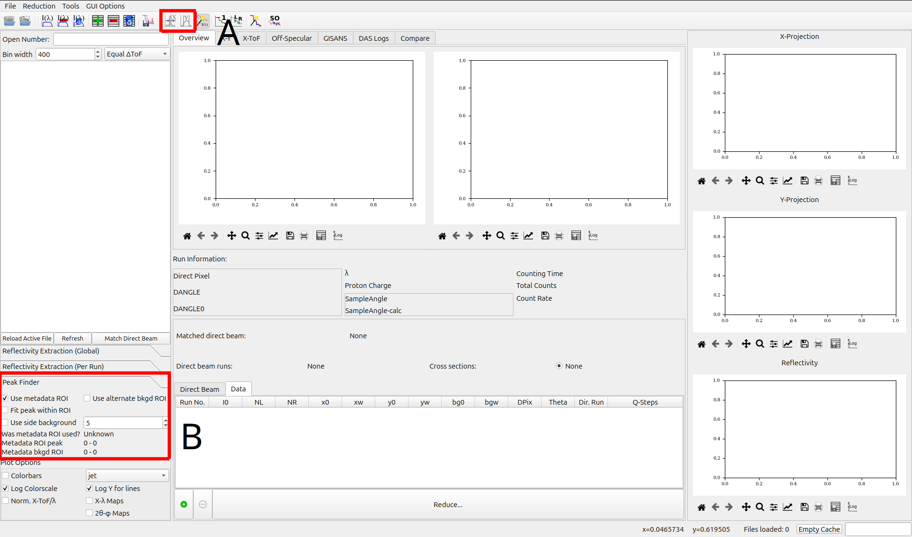

.. _peak_finder:

Peak Finder
===========

The Peak Finder section of the GUI allows you to configure the behavior of the peak finder algorithm.
It is comprised of two main UI elements: toolbar buttons, and a Peak Finder settings panel.
See the image below for reference.

- A: Toolbar
    - **Automatic Peak Finder (X-Axis)**: This setting will automatically search for peaks in reflectivity along the X-axis.
    - **Automatic Y-Limits**: This setting will automatically search for the Y-axis bounds of the beam width.

    Note that these settings are disabled if the **Use metadata ROI** option is selected.

- B: Peak Finder Panel
    - **Use metadata ROI**: Attempt to use the ROI specified within the data file's metadata.
        - If the metadata ROI is absent or invalid, QuickNXS will attempt to automatically determine the ROI.
        - **Note**: This option disables the automatic peak finder options.
    - **Use alternate bkgd ROI**: Use the 2nd ROI in the data file for your background, otherwise a default region will be used.
    - **Fit peak within ROI**: Find the peak within the ROI and redefine the ROI afterwards.
    - **Use side background**: Use the region on either side of the peak to estimate the background.
        - This option is a number which specifies the width of the side background region.

    The panel also contains some information about the ROI metadata from the data file:

    - **Was metadata ROI used?**: This will be set to true if the metadata ROI was used.
    - **Metadata ROI peak**: The peak of the metadata ROI.
    - **Metadata bkgd ROI**: The background of the metadata ROI.
