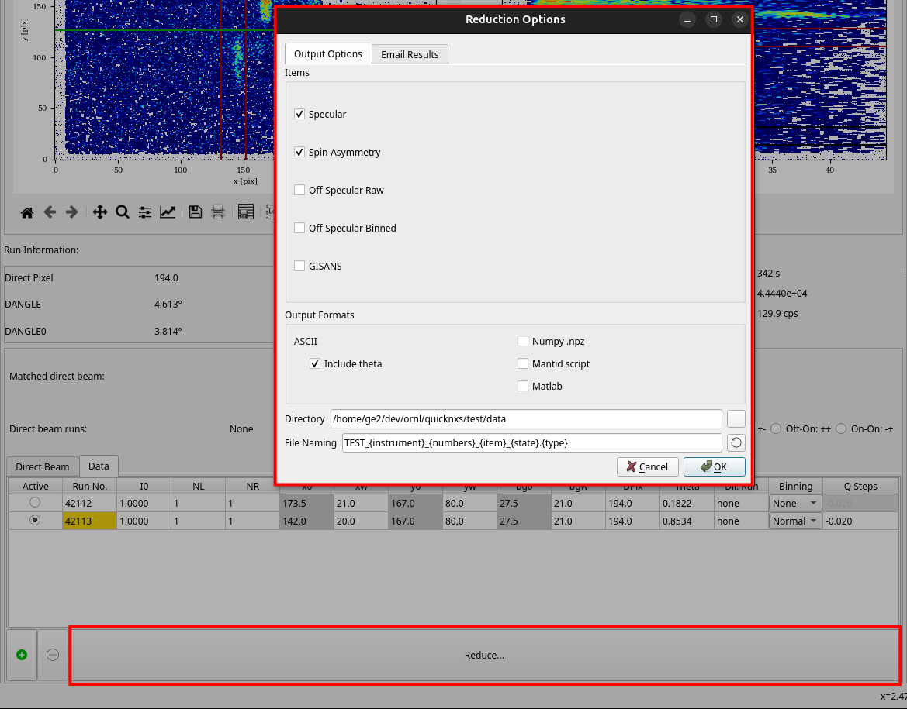

.. _reduction:

Reduction
=========

Reduction Options
-----------------

After clicking the **Reduce** button in the main Reflectometry GUI, the Reduction Options dialog window
appears. This window allows you to configure various settings for the data reduction process,
including output formats and off-specular processing options.

The **Intensity smoothing** checkbox in this dialog controls whether a smoothing algorithm is applied
to off-specular intensity data. When enabled, a smoothing parameters dialog will appear after clicking
OK, allowing you to configure the smoothing grid and sigma values.

For off-specular binned output, binning parameters (X/Y axis ranges and bin counts) are configured
through the **Configure Binned Parameters** button on the Off-Specular tab. These parameters are saved
and reused for future reductions until changed.

See the image below for reference.

Reduction Output
----------------

After successful reduction using the default settings, a number of ``.dat`` and ``.ort`` files are generated in the
output directory, the names and contents depending on which items are selected in the Reduction Options dialog window.
For detailed information on the format of the output files, see the page on :ref:`reduced_data`.

For example, below is a list for run peaks 42535_1 and 42536_1. The particular cross-sections
will depend on the instrument settings, which for these runs turn out to be "Off_Off" and "On_Off".

- **REF_M_42535+42536_peak1_Specular_Off_Off.dat**: combined reflectivity curve for the "Off_Off" cross-section.
- **REF_M_42535+42536_peak1_Specular_On_Off.dat**: combined reflectivity curve for the "On_Off" cross-section.
- **REF_M_42535+42536_peak1_Specular_SA.dat**: spin asymmetry (SA) of the combined reflectivity.
- **REF_M_42535+42536_1_combined.ort**: combined reflectivity curve for all cross-sections for the run peaks (ORSO ASCII format).
- **REF_M_42535_1.ort**: reflectivity curves for all cross-sections for run peak 42535_1 (ORSO ASCII format).
- **REF_M_42536_1.ort**: reflectivity curves for all cross-sections for run peak 42536_1 (ORSO ASCII format).
