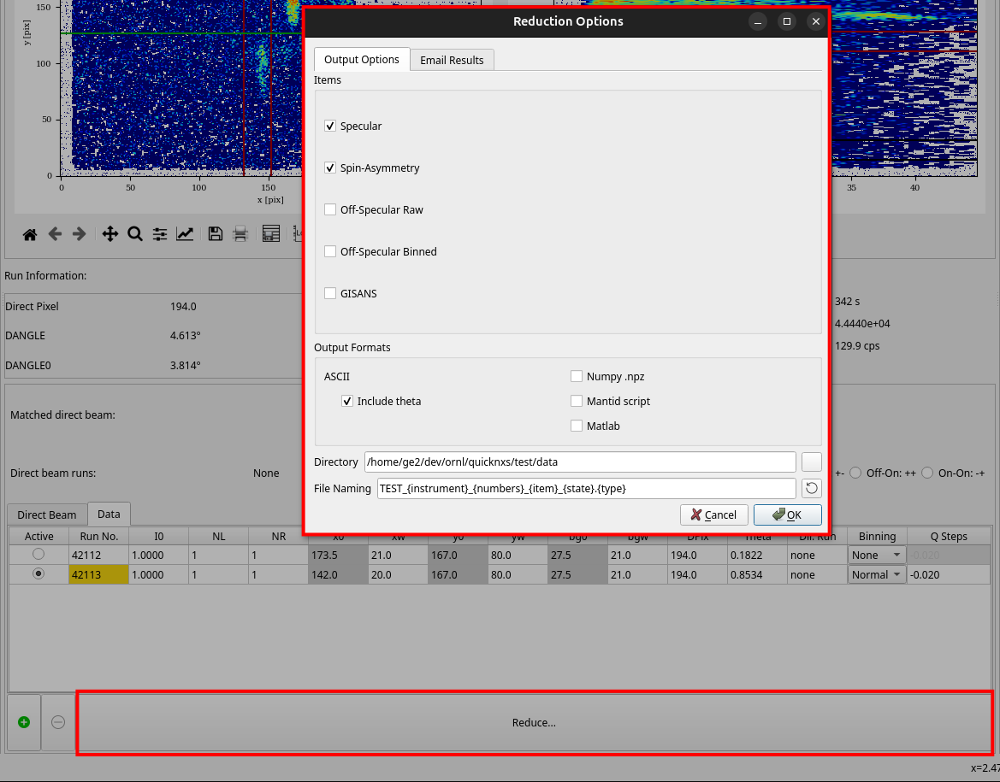

.. _reduction:

Reduction
=========

Reduction Options
-----------------

After clicking the **Reduce** button in the main Reflectometry GUI, the Reduction Options dialog window
appears. This window allows you to configure various settings for the data reduction process,
including output formats and off-specular processing options.

The **Off-Specular Intensity smoothing** checkbox in this dialog controls whether to output off-specular
intensity data with a smoothing algorithm applied. When enabled, a smoothing parameters dialog will appear
after clicking OK, allowing you to configure the smoothing grid and sigma values.

See the image below for reference.

Off-Specular Smoothing Parameters
---------------------------------

The smoothing parameters dialog shows the off-specular data in one of three output types,
selected with the radio buttons: **(ki_z-kf_z) vs. Qz**, **Qx vs. Qz** and **ki_z vs. kf_z**.
The blue box is the region that will be smoothed, and the **X** and **Y** values under
*Smoothing Parameters* are the smoothing radii, drawn as ellipses on the plot.

- The dialog always opens in **(ki_z-kf_z) vs. Qz**.
- Until you change them, the radii default to 0.25% of the width of the blue box in
  **(ki_z-kf_z) vs. Qz**, but never less than 0.0001 1/Å.
- The radii are uniform (Y follows X) by default in **(ki_z-kf_z) vs. Qz** and **ki_z vs. kf_z**,
  and independent in **Qx vs. Qz**.
- Moving the blue box, by editing the region values or by clicking on the plot, leaves the radii
  unchanged.
- Switching output type converts the radii with the relations between the axes, so the smoothing
  spot covers the same region of reciprocal space:

  - **Qx vs. Qz** shares the Qz axis, so Y is unchanged, and X is multiplied by tan(θ\ :sub:`i`),
    using the mean incident angle of the runs.
  - **ki_z vs. kf_z** uses ki_z = (Qz + (ki_z-kf_z)) / 2 and kf_z = (Qz - (ki_z-kf_z)) / 2, so
    uniform radii are divided by √2.

- Coming back to an output type restores the blue box and uniformity you left there.

Clicking **OK** remembers the blue boxes, radii, uniformity and search range for the next time the
dialog is opened. **Cancel** discards the changes. These settings last until QuickNXS is closed and
are not saved between sessions.

Reduction Output
----------------

After successful reduction using the default settings, a number of ``.dat`` and ``.ort`` files are generated in the
output directory, the names and contents depending on which items are selected in the Reduction Options dialog window.
For detailed information on the format of the output files, see the page on :ref:`reduced_data`.

For example, below is a list for run peaks 42535_1 and 42536_1. The particular cross-sections
will depend on the instrument settings, which for these runs turn out to be "Off_Off" and "On_Off".

- **REF_M_42535+42536_peak1_Specular_Off_Off.dat**: combined reflectivity curve for the "Off_Off" cross-section.
- **REF_M_42535+42536_peak1_Specular_On_Off.dat**: combined reflectivity curve for the "On_Off" cross-section.
- **REF_M_42535+42536_peak1_Specular_SA.dat**: spin asymmetry (SA) of the combined reflectivity.
- **REF_M_42535+42536_1_combined.ort**: combined reflectivity curve for all cross-sections for the run peaks (ORSO ASCII format).
- **REF_M_42535_1.ort**: reflectivity curves for all cross-sections for run peak 42535_1 (ORSO ASCII format).
- **REF_M_42536_1.ort**: reflectivity curves for all cross-sections for run peak 42536_1 (ORSO ASCII format).
